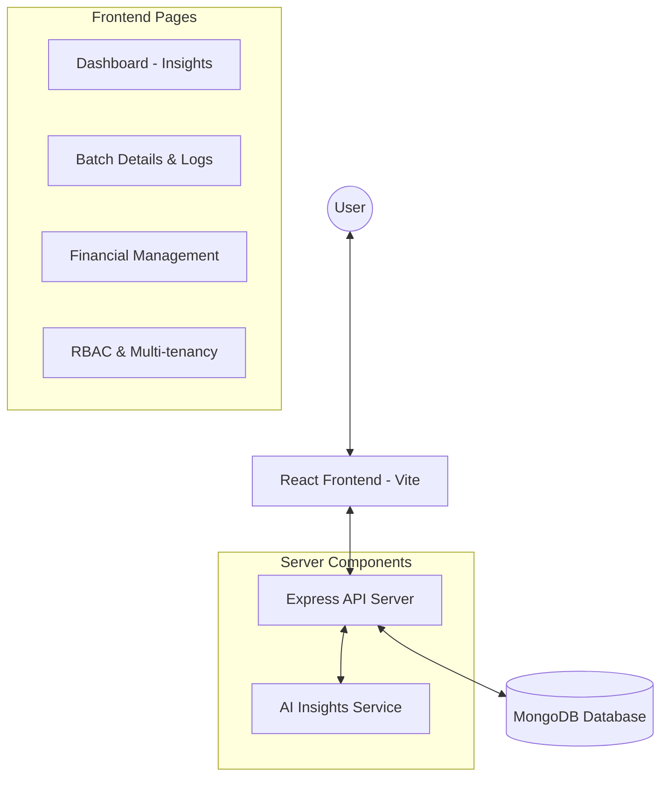

# Hydro Manager - System Architecture

This document describes the high-level architecture of the Hydro Manager SaaS application.

## High-Level Diagram



## Data Flow: AI Insights

1. **Data Collection**: Users log pH and EC readings for their crop batches.
2. **Analysis**: The `AI Service` processes these logs on-demand using statistical methods (Z-score calculation for anomaly detection).
3. **Prediction**: The system calculates the estimated harvest date based on crop types and current growth duration.
4. **Visualization**: The `Dashboard` fetches these insights and displays alerts for anomalies and progress indicators.

## Core Services

- **Auth Service**: Managed via JWT and Bcrypt for secure login and registration.
- **Tenant Management**: Middleware-driven approach to ensure data isolation between organizations.
- **RBAC**: Role-based access control (Owner, Admin, Manager, Member) governing resource modifications.
- **AI Service**: Statistical analysis layer for sensor data and growth forecasting.
```
